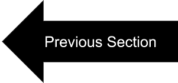
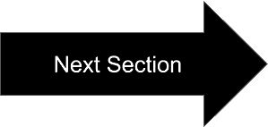

## Section 2: Making a Dataloader

In this scetion, we firstly introduce the two main objects in PyDmed: `BigChunk` and `SmallChunk`.

The below video illustrates the concept:

<div class="myvideo">
   <video  style="display:block; width:100%; height:auto;" autoplay controls loop="loop">
       <source src="sec2bigandsmallchunkv2.mp4" type="video/mp4" />
   </video>
</div>


1. Big chunk: is a relatively big chunk from an instnace. It can be, e.g., a 5000x5000 patch from a huge whole-slide-image.
   In the above video, `BigChunk`s are the big patches that slowly get loaded from hard disk. 
2. Small chunk: a small data chunk collected from a big chunk. It can be, e.g., a 224x224 patch cropped from a 5000x5000 big chunk.
   In the above video, `SmallChunk`s are the red patches which are pushed to queues 1-5 and are then collected for gpu. 


## Making a BigChunkLoader
To specify how to load a bigchunks, you should make a subclass of `lightdl.BigChunkLoader` and implement the
abstract method `lightdl.BigChunkLoader.extract_bigchunk`. 

Here is an example of making a `BigChunkLoader`:

```python
class SampleBigchunkLoader(BigChunkLoader):
    @abstractmethod
    def extract_bigchunk(self, arg_msg):
        '''
        Extract and return a bigchunk.
        Inputs:
            - `arg_msg`: we won't need this argument for now. 
        In this function you have access to `self.patient` and some
        other functions and fields to be covered later on.
        '''
        record_HandE = self.patient.dict_records["H&E"]
        fname_hande = record_HandE.rootdir + record_HandE.relativedir
        osimage = openslide.OpenSlide(fname_hande)
        w, h = 5000, 5000
        W, H = osimage.dimensions
        rand_x, rand_y = np.random.randint(0, W-w),\
                         np.random.randint(0, H-h)
        pil_bigchunk = osimage.read_region(location=[rand_x, rand_y],\
                                           level=0,\
                                           size=[w,h])
        np_bigchunk = np.array(pil_bigchunk)[:,:,0:3]
        bigchunk = BigChunk(\
                    data = np_bigchunk,\
                    dict_info_of_bigchunk = {"x":rand_x, "y":rand_y},\
                    patient = self.patient)
        return bigchunk
```


## Making a SmallChunkCollector:
To specify how to collect a smallchunk from a bigchunk, you should make a subclass of `lightdl.SmallChunkCollector` and implement the 
abstract method `SmallChunkCollector.extract_smallchunk`. 

Here is an example of making a `SmallChunkCollector`:
```python
class SampleSmallchunkCollector(SmallChunkCollector):

    @abstractmethod 
    def extract_smallchunk(self, bigchunk, last_message_fromroot):
        '''
        Extract and return a smallchunk. Please note that in this function you have access to 
        self.bigchunk, self.patient, self.const_global_info.
        Inputs:
            - `bigchunk`: the bigchunk that we just extracted.
            - `last_message_fromroot`: we won't need this argument for now.
        In this function you have access to `self.patient` and some
        other functions and fields to be covered later on.
        '''
        np_bigchunk = bigchunk.data
        W, H = np_bigchunk.shape[1], np_bigchunk.shape[0]
        w, h = 224, 224
        rand_x, rand_y = np.random.randint(0, W-w),\
                         np.random.randint(0, H-h)
        np_smallchunk = np_bigchunk[rand_y:rand_y+h, rand_x:rand_x+w, :]
        #wrap in SmallChunk
        smallchunk = SmallChunk(\
                        ata=np_smallchunk,\
                        dict_info_of_smallchunk=\
                                    {"x":rand_x, "y":rand_y},\
                        dict_info_of_bigchunk = \
                                    bigchunk.dict_info_of_bigchunk,\
                        patient=bigchunk.patient
                      )
        return smallchunk
```

## Making a Dataloader
The last step is to make an instance of `pydmed.lightdl.LightDL` as follows:
```python
const_global_info =\
    pydmed.lightdl.get_default_constglobinf()#tobe covered later on.
dataloader = LightDL(
                dataset = dataset,\
                type_bigchunkloader = SampleBigchunkLoader,\
                type_smallchunkcollector = SampleSmallchunkCollector,\
                const_global_info = const_global_info,\
                batch_size = 10,\
                tfms = torchvision.transforms.ToTensor()
        )
```

Now we can get data from the dataloader as follows:
```python
dataloader.start()
time.sleep(10) #wait for the dataloader to load initial BigChunks.
while True:
    x, list_patients, list_smallchunks = dataloader.get()
    '''
    TODO: `x` is now a tensor of shape [`batch_size` x 3 x 224 x 224].
    `list_patients` is a list of lenght `batch_size`.
     You can use these values to, e.g., update model parameters.
     .
     .
     .
    '''
    if(flag_finish_running == True):
        dataloader.pause_loading()
        break
        
```

[](tutorial_section1.html) | [](tutorial_section3.html)


