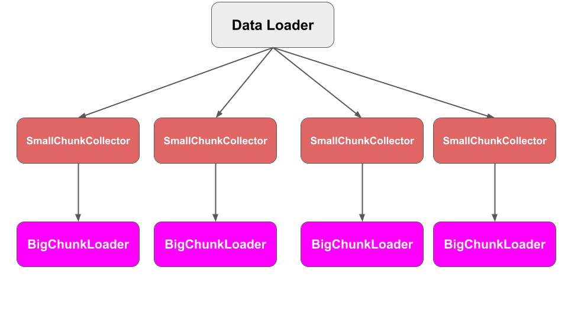

## Section 5: PyDmed Process Tree
PyDmed is implemented using python multiprocessing.
You don't need to know about under the hood.
But this section provides some general information so that you can get the best performance from PyDmed
based on your machine (s).

### The hierarchy of processes
The below figures illustrates the process tree of PyDmed

dsd fs df
### 

