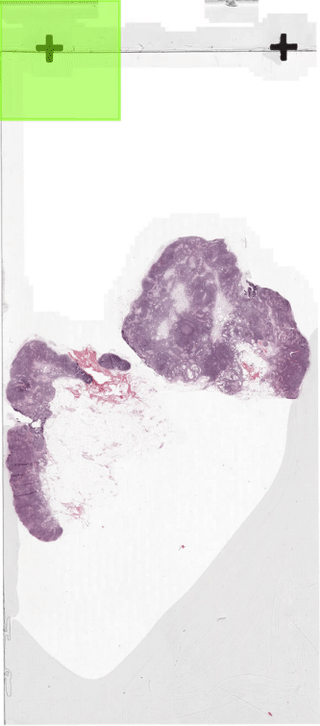

[](tutorial_section4.html) | [](tutorial_section6.html)

## Section 4: Getting Heatmaps for WISs
***Sample notebook to get heatmap is available at the following link: [Link to sample notebook.](https://github.com/amirakbarnejad/PyDmed/blob/8082a02da20c2b5285c722df31326e56ac08f56d/sample_notebooks/Sample3_Heatmap_for_WSIs/sample3_heatmap_for_WSIs.ipynb)***     


In this section we explain how to efficiently get output maps (e.g. output activations of a CNN) for huge whole-slide-images in
PyDmed.
In doing so, we introduce two tools in different subsections:
1. Sliding window dataloader, implemented by the class `pydmed.extensions.wsi.SlidingWindowDL`.
2. Collecting and processing a stream of smallchunks.   

### Sliding-window dataloader
Sliding-window dataloader considers a square of a specific size (a square of size `kernel_size`), and slides
 it over a whole-slide-image with a specific stride as set by the variable `stride`.
 
The below figure illustrates how the sliding-window dataloader returns patches.



In [section 2](tutorial_section2.html) we discussed how to create a dataloader.
Making a sliding-window dataloader is almost the same.
The only difference is that sliding-window dataloader (i.e., `SlidingWindowDL`)
needs few additional arguements. The below code illustrates how to create a sliding-window dataloader:
```python
dl_forheatmap = pydmed.extensions.wsi.SlidingWindowDL(
    intorfunc_opslevel = 1,
    kernel_size = kernel_size,
    stride = kernel_size,
    mininterval_loadnewbigchunk = 15,
    dataset = dataset,\
    type_bigchunkloader=pydmed.extensions.wsi.SlidingWindowBigChunkLoader,\
    type_smallchunkcollector=pydmed.extensions.wsi.SlidingWindowSmallChunkCollector,\
    const_global_info=const_global_info,\
    batch_size=1,\
    tfms_onsmallchunkcollection=tfms_onsmallchunkcollection,\
    tfms = tfms_oncolate,
    flag_grabqueue_onunsched = True
  )
``` 
The `SlidingWindowDLTODO` has 4 additional arguments compared to the normal dataloader we discussed in
[section 2](tutorial_section2.html):

`intorfunc_opslevel`: This arguments specifies the pyramidal image's level from which the patches
are going to be extracted. For example when this argument is set to 1, patches will be extracted from level 1.
In histopathology datasets it is quite common to have slides which are scanned at different magnification levels.
For instnace in a dataset some of the slides might be scanned at $20x$ magnification level, while some others at $40x$ magnification level.
In this case, one may need to consider the level based on magnification level (e.g. level 0 for $40x$ slides and level 1 for $20x$ slides).
For doing so, you can implement a function that decides a specific level for each WSI. Afterwards, you need to
pass the function as the argument `intorfunc_opslevel`. The below code demonstrates the procedure:

```python
def func_getopslevel(patient_input):
    flag_some_condition_on_patient = ... #Here you can make a boolean.
    if(flag_some_condition_on_patient == True):
        target_level = 0
    else:
        target_level = 1
    return target_level
    
dl_forheatmap = pydmed.extensions.wsi.SlidingWindowDL(
          intorfunc_opslevel = func_getopslevel,
          .... other arguements .... 
    )
```

2. `kernel_size`: an integer, the width of the sliding-window. This argument is analogous to 
the `kernel_size` argument of, e.g., [pytorch's Conv2d module](https://pytorch.org/docs/stable/generated/torch.nn.Conv2d.html).
3. `stride`: an integer, the amount of shift of the sliding-window in each step.
This argument is analogous to 
the `stride` argument of, e.g., [pytorch's Conv2d module](https://pytorch.org/docs/stable/generated/torch.nn.Conv2d.html).
4. `mininterval_loadnewbigchunk`: the minimum time (in seconds) between loading two BigChunks.
The value is typically between 10 and 30 based on the mahcine being used.
In case you noticed the dataloader is demanding too much from the machine, you can increase this argument. 


### Processing a stream of small-chunnks
So far we saw how `SlidingWindowDL` makes a stream of `SmallChunk`s.
But how to process these smallchunks and produce, e.g., a heatmap?
For huge whole-slide-images, heatmaps also become very huge, and it is not often possible to store them in RAM.
Indeed, once a samllchunks if processed the processed information must be written to disk 
(instead of being saved in RAM).
For doing so, PyDmed provides a simple yet effective abstraction as illustrated by the following figure:

The process of getting, e.g., heatmaps for WSIs has three components:
1. Dataloader: A dataloader (in this case `SlidingWindowDL`) makes a stream of patches.
2. StreamCollector: This component recieves the stream of smallchunks generated by the dataloader.
After processing one smallchunk, the StreamCollector hands over the "processed piece" (for instance the value of
heatmap for that specific smallchunk) to the next step.
3. StreamWriter: this component receives a stream of processed pieces and writes them on disk.

Please note that the three above components are done by different processes.
Specificly, the first and the third components make disk read/writes in a parallel way.
Therefore, the above scheme is very efficient. 
PyDmed provides a straightforward way to make a customized StreamCollector. 
For doing so, you can make a subclass from `StreamCollector`.
You are required to implement two methods:
1. the function `process_pieceofstream`: This function specifies how the outputs from the dataloader
are processed. More precisely, given some return values from the dataloader, in `process_pieceofstream` 
you need to process the smallchunks and return a set of `ProcessedPieceTODO`s. 
2. the fucntion `get_flag_finishcollecting`: In this fucntion you should decide whether the whole processing
has been finished. If it is finished, you have to return True and you have to return False otherwise.
For the sliding window dataloader, you can leave the function `get_flag_finishcollecting`
as implemented in the below code.

The below box demonstrates how to build a `StreamCollector` that produces heatmaps for WSIs:
```python
import pydmed.streamcollector
from pydmed.streamcollector import *

class HeatmapStreamCollector(StreamCollector):
    def __init__(self, module_pipeline, device, *args, **kwargs):
        #grab privates
        self.module_pipeline = module_pipeline
        self.device = device
        #make other initial operations
        self.module_pipeline.to(device)
        self.module_pipeline.eval()
        self.num_calls_to_getflagfinished = 0
        super(HeatmapStreamCollector, self).__init__(*args, **kwargs)
        
        
    @abstractmethod
    def process_pieceofstream(self, retval_collatefunc):
        x, list_patients, list_smallchunks = retval_collatefunc
        with torch.no_grad():
            netout = \
                self.module_pipeline(x.to(self.device))#[32x1x7x7]
            list_processedpiece = []
            for n in range(netout.shape[0]):
                tensor_piecen = netout[n,0,:,:].unsqueeze(0)
                str_piecen = pydmed.extensions.wsi.Tensor3DtoPdmcsvrow(
                                tensor_piecen.detach().cpu().numpy(), list_smallchunks[n]
                            )
                list_processedpiece.append(
                                   ProcessedPiece(
                                      data = str_piecen,\
                                      source_smallchunk = list_smallchunks[n]
                                    )
                                 )
        return list_processedpiece
    
    @abstractmethod
    def get_flag_finishcollecting(self):
        self.num_calls_to_getflagfinished += 1
        is_dl_running = self.lightdl.is_dl_running()
        if((is_dl_running==False) and (self.lightdl.queue_lightdl.qsize()==0)):
            return True
        else:
            return False
```
Pleae note that `Tensor3DtoPdmcsvrow` converts any numpy array of shape [CxHxW] to a string.
Indeed, `str_piecen` contains the values of [CxHxW] array as well as some other information needed to 
make the C-dimensional feature map.
You can simply make an instance from `HeatmapStreamCollector` and call its `start_collecting()`
function:
```python
statcollector = HeatmapStreamCollector(
                module_pipeline=model,
                device = device,
                lightdl = dl_forheatmap,
                str_collectortype = "stream_to_file",
                flag_visualizestats= False,
                kwargs_streamwriter = {
                    "rootpath": "./Output/GeneratedHeatmaps/",
                    "fname_tosave":None, 
                    "waiting_time_before_flush":3
                }
            )
statcollector.start_collecting()
```

For each `Patient`, a separate csv file will be created in "./Output/GeneratedHeatmaps/".
Getting heatmap for WISs takes several minutes. 
After several minutes, all information to get heatmaps will be saved on those csv files.
Each line of those csv files includes the following information:
1. [y,x]: the position of the extracted smallchunk.
2. [H,W]: the size of the WSI at target level.
3. level: the level from which the smallchunk is extracted.
4. kernel size: the size of kernel.
5. downsample in the level: the downsample (w.r.t level 0) for the target leve.
6. C, H, W: the dimensions of the numpy array fed to `pydmed.extensions.wsi.Tensor3DtoPdmcsvrow`.
7. content of the [CxHxW] array.

You can convert each csv file to a heatmap by calling one function as follows:
```python
default_wsitoraster = pydmed.extensions.wsi.DefaultWSIxyWHvaltoRasterPoints()
fname_pdmcsv = "./Output/GeneratedHeatmaps/patient_1.csv"
np_heatmap = pydmed.extensions.wsi.pdmcsvtoarray(
                        fname_pdmcsv,
                        default_wsitoraster.func_WSIxyWHval_to_rasterpoints,
                        scale_upsampleraster = 1.0
                    )
```
You can increase the parameter `scale_upsampleraster` to increase the heatmap's resolution.
***Sample notebook to get heatmap is available at the following link: [Link to sample notebook.](https://github.com/amirakbarnejad/PyDmed/blob/8082a02da20c2b5285c722df31326e56ac08f56d/sample_notebooks/Sample3_Heatmap_for_WSIs/sample3_heatmap_for_WSIs.ipynb)***     


[](tutorial_section4.html) | [](tutorial_section6.html)

