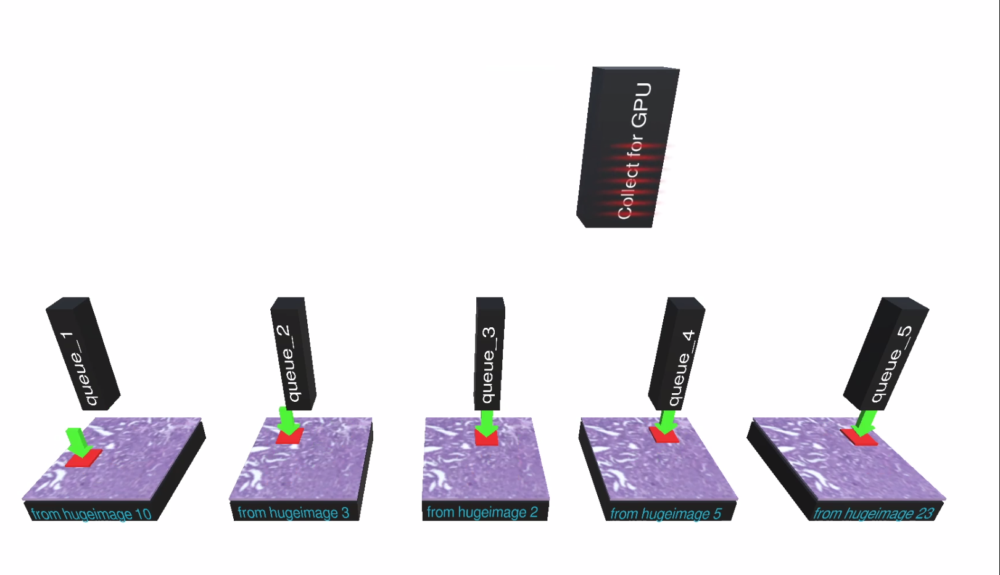

[](tutorial_section4.html) | [](tutorial_section6.html)


## Section 5: PyDmed Process Tree
PyDmed is implemented using python multiprocessing.
You don't need to know about under the hood.
But this section provides some general information so that you can get the best performance from PyDmed
based on your machine (s).

### The hierarchy of processes
The below figure illustrates the process tree of PyDmed.


Each `BigChunkLoader` is a child (i.e. subprocess) of a `SmallChunkCollector`.
Once the `BigChunk` is loaded, the `BigChunkLoader` iteself is terminated. But the parent `SmallChunkCollector`
will continue working on the `BigChunk`.

Each `SmallChunkCollector` (and its child `BigChunkLoader`) correspond to one `Patient`.
Indeed, a `SmallChunkCollector` and the child `BigChunkLoader` work on a specific `Patient`.
Moreover, the dataloader makes sure that at all times at most one active `SmallChunkCollector` works on a specific `Patient`.

### Life Cycle of Subprocesses
In regular intervals:
1. The scheduler selects a patient from the dataset.
2. A `BigChunkLoader` extracts a big chunk from the patient's records. The `BigChunkLoader` has access to the patient by `self.patient`.
3. The extracted big chunk is passed to a `SmallChunkCollector`. The `SmallChunkCollector` has access to the patient by `self.patient`.


### Tailoring the dataloader to your machine (s)



The parameters of the dataloader are managed by a dictionary called `const_global_info`.
It has the following fields:
- `const_global_info["num_bigchunkloaders"]`: an integer. Is the number of running `BigChunkLoader`s.
        According to the process tree, this number is also equal to the number of running `SmallChunkCollector`s.
- `const_global_info["maxlength_queue_smallchunk"]`: an integer. Maximum length of the queues containing `SmallChunk`s.
                            The above figure illustrates those queues: queue_1, queue_2, ..., and queue_5.
- `const_global_info["maxlength_queue_lightdl"]`: an integer. The maximum length of the dataloader's queue. In the above figure,
                             this queue is the queue at the top that moves to right-left and collects `SmallChunk`s to send to GPU(s).
- `const_global_info["interval_resched"]`: a floating point number. The regular intervals at which the dataloader terminates one of the `SmallChunkCollector`s
   and starts a new `SmallChunkCollector` (and its child `BigChunkLoader`).
   
- `const_global_info["core-assignment"]`: This field lets you assign the processes in the process tree to different cores.
For instance, the following code assigns the dataloader, `SmallChunkCollector`s and `BigChunkLoader`s to cores
 {4}, {0}, {1,2,3}.
```python
const_global_info["core-assignment"] = {
                       "lightdl":"4",
                       "smallchunkloaders":"0",
                       "bigchunkloaders":"1,2,3"
                       }
```
Core assignment uses [taskset](https://man7.org/linux/man-pages/man1/taskset.1.html) and is only supported for linux.

As we saw in [section 2][tutorial_section2.html] we can use the default `const_global_info` as follows:
```python
const_global_info =\
    pydmed.lightdl.get_default_constglobinf()
```
Here are some points that may help you customize `const_global_info`:
- having very large queues (i.e. large values for "maxlength_queue_lightdl" and "maxlength_queue_smallchunk")
  increases memory usage.
- Loading a `BigChunk` is a slow process. Therefore, setting 
  "interval_resched" to a small value may result in many IO requests beyond hard disk reading speed.
- In the process tree, the dataloader process is essential. It may so happen that `SmallChunkCollector` take over the 
  cores and cause the dataloader process (i.e. the root process in the tree) to starve. PyDmed automatically
  avoids this issue by using [os.nice](https://docs.python.org/2/library/os.html).
  To further avoid this issue, in linux machines you can use the `core-assignment` field.
  
  
[](tutorial_section4.html) | [](tutorial_section6.html)

