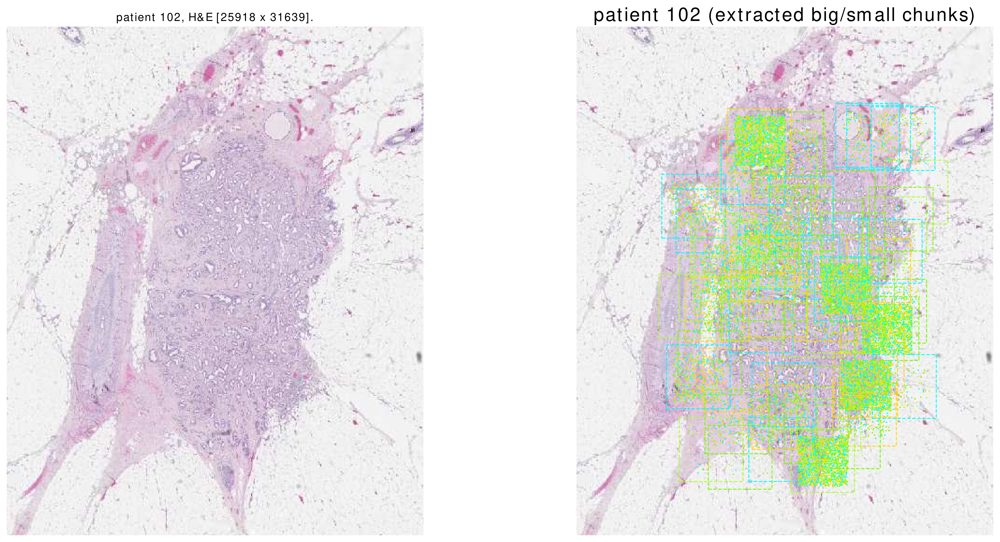
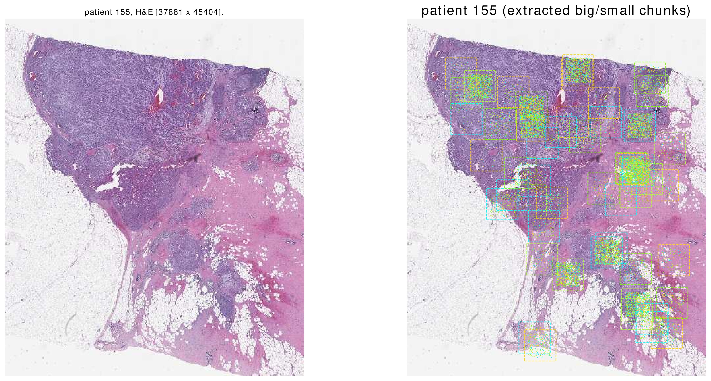
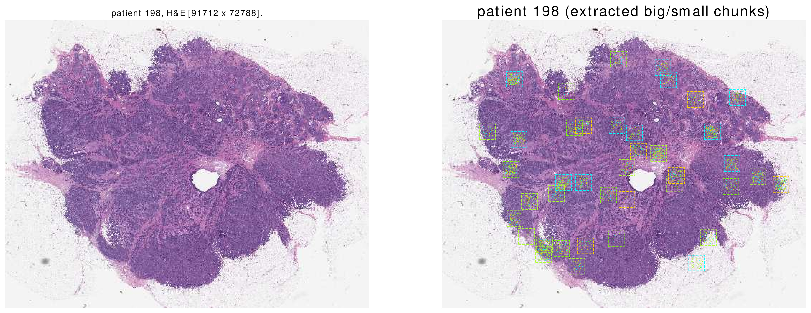

[](tutorial_section4.html) | [](tutorial_section6.html)


## Section 5: Visualization

Assume we have used the dataloader to, e.g., learn a generative model on random patches.
Assume we want to "see" the patches that the dataloader has returned.
As in section 2, the code for training is rougly as follows:
```python
dataloader.start()
time.sleep(10) #wait for the dataloader to load initial BigChunks.
while True:
    x, list_patients, list_smallchunks = dataloader.get()
    '''
     `x` is now a tensor of shape [`batch_size` x 3 x 224 x 224].
     `list_patients` is a list of lenght `batch_size`.
     TODO: You can use these values to, e.g., update model parameters.
     .
     .
     .
    '''
    if(flag_finish_running == True):
        dataloader.pause_loading()
        break
        
```

To visualize the collected `SmallChunk`s, you only need to implement a function that takes in:
1. `patient`: an instnace of `Patient`.
2. `list_smallchunks`: a list of `SmallChunk`s. This list contains all the returned `SmallChunk`s that correspond to `patient`.
    

Here is an example implementation of such a function. 
This function shows a thumbnail of the patient's H&E slide. Afterwards, it shows `BigChunk`s as squares and `SmallChunk`s' centers as points on the thumbnail.  

```python
def func_visualize_one_patient(patient, list_smallchunks):
    '''
    Given all smallchunks collected for a specific patient, this function
    should visualize the patient. 
    Inputs:
     - patient: 
      the patient under considerations, an instance of `utils.data.Patient`.
     - list_smallchunks: the list of all collected small chunks for the patient,
         a list whose elements are an instance of `lightdl.SmallChunk`.
    '''
    #settings =======
    vis_scale = 0.1 #=====
    fname_wsi = patient.dict_records["wsi"].rootdir +\
                patient.dict_records["wsi"].relativedir
    opsimage = openslide.OpenSlide(fname_wsi)
    W, H = opsimage.dimensions
    opsimageW, opsimageH = opsimage.dimensions
    W, H = int(W*vis_scale), int(H*vis_scale)
    pil_thumbnail = opsimage.get_thumbnail((W,H))
    plt.ioff()
    fig, ax = plt.subplots(1,2, figsize=(2*10,10))
    ax[0].imshow(pil_thumbnail) #show the thumbnail
    ax[0].axis('off')
    ax[0].set_title("patient {}, H&E [{} x {}]."\
                   .format(patient.int_uniqueid, opsimageW, opsimageH))
    ax = ax[1]
    ax.imshow(pil_thumbnail)
    ax.axis('off')
    print("patient {}, number of smallchunks={}"\
          .format(patient, len(list_smallchunks)))
    list_colors = ['lawngreen', 'cyan', 'gold', 'greenyellow']
    list_shownbigchunks = []
    for smallchunk in list_smallchunks:
        #show the bigchunk ================
        x = smallchunk.dict_info_of_bigchunk["x"]
        y = smallchunk.dict_info_of_bigchunk["y"]
        x, y = int(x*vis_scale), int(y*vis_scale)
        if(not([x,y] in list_shownbigchunks)):
            w, h = int(1000*vis_scale), int(1000*vis_scale)
            rect = patches.Rectangle(
                            (x,y), w, h, linewidth=1,\
                            linestyle="--",\
                            edgecolor=random.choice(list_colors),\
                            facecolor='none', fill=False
                            )
            ax.add_patch(rect)
            list_shownbigchunks.append([x,y])
        
        #get x,y,w,h ======
        x = smallchunk.dict_info_of_smallchunk["x"]*vis_scale +\
            smallchunk.dict_info_of_bigchunk["x"]*vis_scale
        y = smallchunk.dict_info_of_smallchunk["y"]*vis_scale +\
            smallchunk.dict_info_of_bigchunk["y"]*vis_scale
        x, y = int(x), int(y)
        w, h = int(224*vis_scale), int(224*vis_scale)
        x_centre, y_centre = int(x+0.5*w), int(y+0.5*h)
        #make-show the rect =====
        circle = patches.Circle((x_centre, y_centre), radius=w*0.05,\
                                 facecolor=random.choice(list_colors),\
                                 fill=True)
        ax.add_patch(circle)
    plt.title("patient {} (extracted big/small chunks)"\
              .format(patient.int_uniqueid), fontsize=20)
    plt.savefig("Visualization/patient_{}.eps"\
                .format(patient.int_uniqueid), bbox_inches='tight',\
                 format='eps')
    plt.close(fig)
```
Once data loading is finished (i.e. after calling `dataloader.pause_loading()`) we can visualize the collected `SmallChunk`s as follows:
```python
dataloader.visualize(func_visualize_one_patient)
```
Afterwards, according to the above `func_visualize_one_patient` for each patient one image will be created.
Here are some sample images. Please note that these are all of the `SmallChunk`s which are returned by the function `dataloader.get()`.







[](tutorial_section4.html) | [](tutorial_section6.html)


