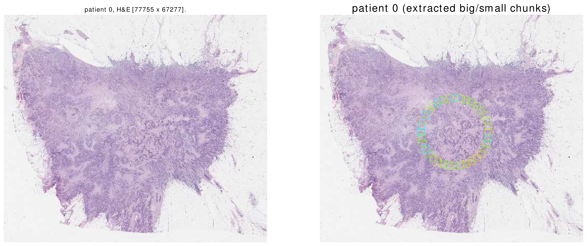
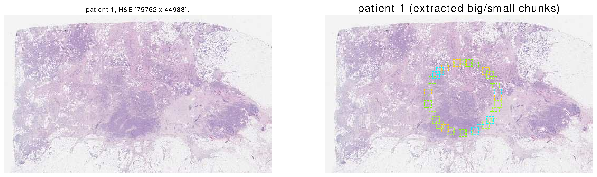
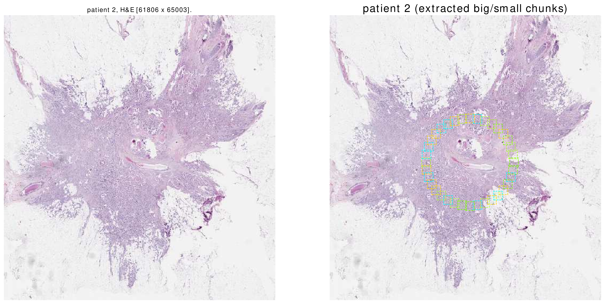
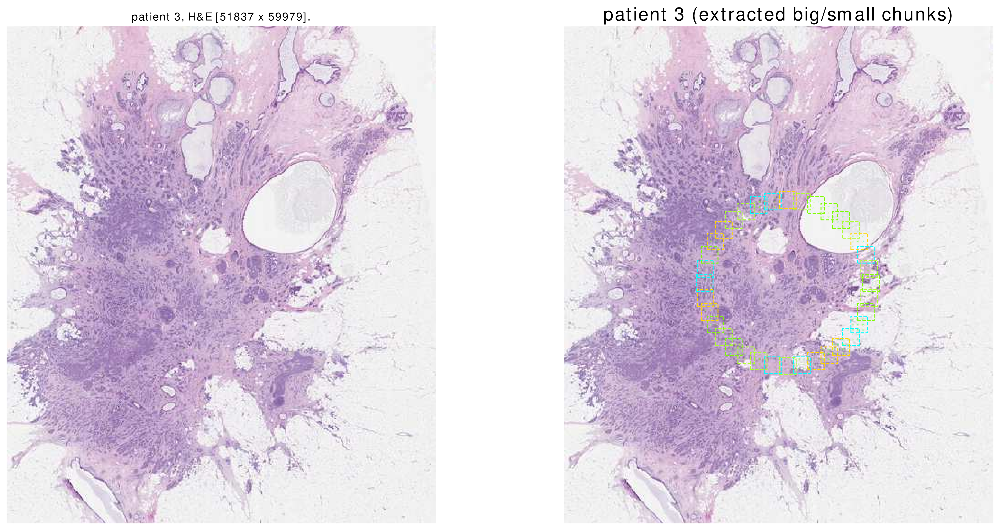
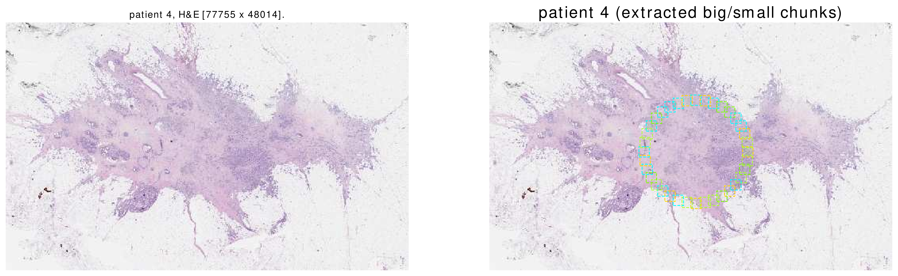

[](tutorial_section8.html) | [](tutorial_section10.html)


## Section 9: Call Count

In [section 6](tutorial_section6.html) we reviewed the life cycle of `BigChunkLoader`s and `SmallChunkCollector`s.


In regular intervals:
1. The scheduler selects a patient from the dataset.
2. A `BigChunkLoader` extracts a big chunk from the patient's records. The `BigChunkLoader` has access to the patient by `self.patient`.
3. The extracted big chunk is passed to a `SmallChunkCollector`. The `SmallChunkCollector` has access to the patient by `self.patient`.


In previous section we introduced the functions `set_checkpoint` and `get_checkpoint`.
Now we introduce the argument `call_count` which is passed to the `SmallChunkCollector`.
Once the `SmallChunkCollector` starts, the passed `call_count` is zero.
The argument `call_count` is the number of calls to the `SmallChunkCollector`'s `extract_smallchunk` function
                 since the `SmallChunkCollector` has started working. 

```python
class SampleSmallchunkCollector(SmallChunkCollector):

    @abstractmethod 
    def extract_smallchunk(self, call_count, bigchunk, last_message_fromroot):
        '''
        Inputs:
            - call_count: The number of calls to `extract_smallchunk`
                 since the `SmallChunkCollector` has started working.
            - bigchunk: introduces before.
            - last_message_fromroot: to be covered.
        
        '''
        '''
        .
        .
        .
        same as before 
        .
        .
        .
        '''
        return smallchunk
```
Please note that unlike a "checkpoint", the `call_count` argument is related to the `SmallChunkCollector` rather than the `Patient`.

Here is a [sample notebook](http://github.com/amirakbarnejad/PyDmed/tree/master/sample_notebooks/sample_2_setgetcheckpoint.ipynb)
that combines `call_count`, `set_checkpoint` and `get_checkpoint` to explore each whole-slide-image in a circular path.

Here are the results (high-quality .eps images are provided in [this folder](https://github.com/amirakbarnejad/PyDmed/tree/master/sample_notebooks/Sample_2_Output)):








[](tutorial_section8.html) | [](tutorial_section10.html)

